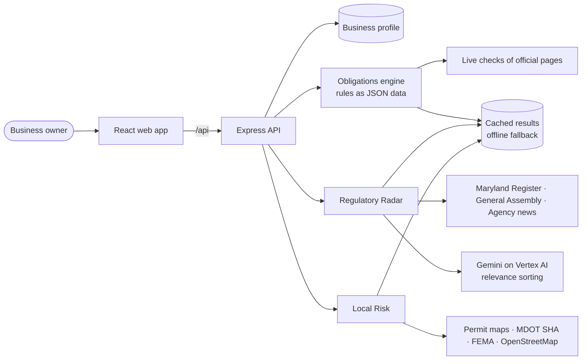

# RegWise

**A compliance and risk assistant that watches everything affecting a Maryland small business, from state labor laws and tax deadlines to roadwork outside the front door.**

🎬 **Demo video:** https://www.youtube.com/watch?v=-JYpbnG1hPA
🔗 **Live app:** https://civicpulse-102365937725.us-east4.run.app
🔑 **Demo login:** `demo@regwise.test` / `RegWise-tZnc-oecR-7jbE` (a 14-employee restaurant in Baltimore City), or create your own account with **Sign up**.

> Information, not legal advice. Every item links to its official source.

[](https://www.youtube.com/watch?v=-JYpbnG1hPA)

---

## The problem

Walmart and Target spend millions on full-time legal, tax, and government-affairs teams whose job is to watch new legislation, tax changes, and city planning.

A local bakery or auto shop has one person doing that job: the owner, after closing time.

Small businesses face the same rules, but they find out late, through a fine, a missed deadline, or a road closure that cuts off their customers. The information is public, but it's scattered across dozens of agency websites, the Maryland Register, the General Assembly, and county permit maps. Most of it is written for lawyers.

## Our solution

RegWise turns that enterprise-style monitoring into an affordable assistant. An owner enters their business once: what they do, where they are, and how many people they employ. RegWise then answers three questions for that business:

| | Question | What you get |
|---|---|---|
| 📋 **Obligations** | *What do I have to do right now?* | Registrations, filings, payments, postings and deadlines that apply to *your* business, each with a plain-English reason and a link to the official source |
| 📡 **Regulatory Radar** | *What's changing?* | New and upcoming laws, proposed regulations and agency announcements, sorted into "Affects you" and "Doesn't apply", with comment deadlines |
| 📍 **Local Risk** | *What's happening around me?* | Construction, road work, closures and permitted projects near your address, on a map with a High / Medium / Low risk level |

It works for **any Maryland business and address**. Baltimore City and Baltimore County have the deepest local data. Everywhere else still gets statewide rules and statewide sources.

## Features

**Onboarding**
- Step-by-step setup: business type, entity type, address, employee counts, and yes/no questions (tipped staff, serves alcohol, sells to government, and more).
- The address is checked with the U.S. Census geocoder and Maryland's municipal boundaries, so we know the real county and town. Many "Baltimore, MD" addresses are actually in Baltimore County, not Baltimore City, and we use the official county code, never the city name in the address.
- Four separate employee counts (all states, in Maryland, full-time in Maryland, FMLA coverage), because each law counts employees differently.

**Obligations**
- 88 rules covering federal, state, county, town, payroll, FAMLI, licensing, alcohol and local tax. Each is marked **Affects you**, **Might affect you** or **Doesn't apply**, with the reason.
- A filing schedule grouped by agency, with upcoming due dates. Dates that fall on weekends or holidays move to the next business day.
- Calendar export (.ics) for all deadlines.
- Tax rates, minimum wages and the FAMLI rate are **read live** from official pages every day, and each rule's key facts are re-checked against its source.
- One-time items can be marked done.

**Growth Planner**
- **Hire more people:** a slider shows which obligations switch on as you grow. For example, FAMLI's employer share starts at 15 employees.
- **Open another location:** enter an address to see what's new, different, or the same at the new site, including county minimum wages and local licenses.

**Regulatory Radar**
- Monitors the Maryland Register (proposed and final regulations), the General Assembly (bills and enacted laws with effective dates), agency news (Labor, FAMLI, Comptroller, SDAT), and rate changes found by the daily Obligations checks.
- **AI relevance sorting:** Google Gemini reads each change against the business profile and decides whether it affects the business, with a one-sentence reason. For example, "Applies because you run a restaurant in Baltimore City." It is instructed to be conservative and never invent dates or requirements.
- "Have your say" lists open public-comment periods and hearings for changes that affect you, with days remaining.
- Refreshes daily at 6 AM, or on demand with **Check now**.

**Local Risk**
- Nearby building permits (Baltimore City, Baltimore County), Baltimore County development plans, MDOT SHA state road projects, and reported road closures statewide.
- A rule-based **High / Medium / Low** risk level from distance, project type and timing, with no made-up percentages.
- Impact tags (for example "Access & parking") that explain how each project could affect the business.
- "New nearby" flags for anything that appeared in the last 7 days.
- Location context: zoning (Baltimore City and County), FEMA flood zone, and nearby competitors from OpenStreetMap.
- Map and list views with radius and filters.

**Dashboard:** one screen summarizing all three modules after login.

## How it works



- **Rules are data, not code.** Obligations come from JSON rule files evaluated by an engine. Nothing is hard-coded for a specific business.
- **Every outside call happens on the server,** with polite rate limits (about 1 request per second per site) and a descriptive User-Agent. The browser never calls outside services directly.
- **Everything is cached.** If a government site is down or blocks us, the app shows saved results with "Showing saved results from [date]" and never crashes.
- **Scheduled jobs** refresh Obligations checks, the Radar (daily) and Local Risk (every 12 hours) in the background.

## Built for accuracy

Compliance advice that's wrong is worse than none, so we set strict rules for ourselves:

1. **Never invent numbers, dates, or requirements.** If data is missing, we say so.
2. **Every item links to its official source.** Every rule records the date we last reviewed it.
3. **When unsure, say "might".** An uncertain answer is never shown as a confident "affects" or "doesn't apply".
4. **Our own words.** Summaries are short, plain-English, and written by us, never copied regulation text.
5. **Estimates are labeled.** Local Risk levels are rule-based, with no percentages, foot-traffic or revenue guesses.
6. **Be polite to government sites.** If a site blocks us (HTTP 403), we skip it and report it as unavailable. We never try to get around a block.

## Tech stack

| Layer | Technology |
|---|---|
| Frontend | React, Vite, React Router, Tailwind CSS, Leaflet (OpenStreetMap tiles) |
| Backend | Node.js, Express 5, TypeScript (run with `tsx`), `zod` validation, `node-cron` jobs |
| AI | Google Gemini (`gemini-3.8-flash`) through **Google Cloud Vertex AI**, via the Google Gen AI SDK |
| Parsing | `cheerio` (HTML), `pdf-parse` (PDFs), `ics` (calendar export) |
| Data | JSON files (no database), with a cache for every outside source |
| Hosting | Google Cloud Run (one container serving the API and the built frontend) |

## Data sources

| Purpose | Source |
|---|---|
| Address → county / town | U.S. Census Geocoder; MD iMAP municipal boundaries |
| Tax rates, wages, FAMLI rate | Maryland Department of Labor, FAMLI, Department of Legislative Services (read live) |
| Proposed and final regulations | Maryland Register (Division of State Documents) |
| Bills and new laws | Maryland General Assembly bill index and effective-date lists |
| Agency news | MD Labor, FAMLI, Comptroller of Maryland, SDAT |
| Nearby permits and projects | Open Baltimore (city permits); Baltimore County open data (permits, development plans); MDOT SHA projects and road closures |
| Location context | FEMA National Flood Hazard Layer; Baltimore City and County zoning; OpenStreetMap (Overpass) |

## Try it

1. Open the **[live app](https://civicpulse-102365937725.us-east4.run.app)** and log in with `demo@regwise.test` / `RegWise-tZnc-oecR-7jbE` (the login page can fill it in for you), or sign up and enter your own business.
2. **Obligations:** see what a 14-person Baltimore City restaurant owes, and why.
3. **Growth Planner:** slide to 15 employees and watch FAMLI's employer share switch on. Or open a second location in Rockville and see Montgomery County's higher minimum wage.
4. **Regulatory Radar:** new laws and rules sorted for a restaurant, with open comment deadlines.
5. **Local Risk:** permits and road work around 1621 Thames St, Fells Point.
6. **Settings:** change the address to anywhere in Maryland, and everything updates.

We tested every module against five sample businesses: a Baltimore City restaurant (14 employees), a Rockville salon (6), a one-person LLC in Frederick (0), an Ocean City hotel (40), and a Baltimore County contractor that sells to government (60).

## Team

Built in 18 hours at HackUMBC by a team of three, each owning one module end to end:

- **Yasin Ibrahim**: onboarding, Obligations engine and rules, Growth Planner, dashboard, and the shared app skeleton
- **Buruk Ayalew**: Regulatory Radar (sources, Gemini relevance sorting) and Google Cloud deployment
- **Firaol Desta**: Local Risk (permits, road projects, risk scoring, map, location context)

## What's next

- Coverage beyond Maryland: county and town permit feeds and local codes for areas outside of Maryland
- Email or text alerts when something new affects your business.
- A real database, so accounts and profiles persist across deploys.

---

## Developer guide

### Run locally

```bash
npm install                          # from the repo root; installs server and client
cp server/.env.example server/.env   # then set SESSION_SECRET
npm run dev                          # API on :3001, web app on http://localhost:5173
```

Test login: **demo@regwise.test / RegWise-tZnc-oecR-7jbE**. It is created (or its password updated) on server start with the Baltimore City restaurant profile.

Other scripts: `npm run typecheck`, `npm run build`, `npm run check:obligations -w server` (runs the rules engine against all 5 sample profiles and checks the expected results).

**Radar sorting on your own machine (optional).** Visitors to the live app need none of this. Locally, the Radar sorts new items with Gemini on Vertex AI, which needs a Google Cloud login. Without it the app still runs; previously sorted results (committed in `server/data/cache/`) are used, and new items wait until they can be sorted.
1. The project owner grants your Google account **Vertex AI User** and **Service Usage Consumer** on project `project-79cc0670-01b4-43ca-94d`.
2. Then run:
   ```bash
   brew install --cask google-cloud-sdk        # or https://cloud.google.com/sdk/docs/install
   gcloud auth login
   gcloud config set project project-79cc0670-01b4-43ca-94d
   gcloud auth application-default login       # the login the server uses
   gcloud auth application-default set-quota-project project-79cc0670-01b4-43ca-94d
   ```
3. Keep `GCP_LOCATION=global` in `server/.env` (see `server/.env.example`). The Gemini 3.x models aren't served from `us-central1` for this project.

### Obligations: how rules work

Obligations are **data, not code**. Every `server/data/rules/*.json` file (except `local-tax-rates.json`) holds an array of rules. The engine (`server/src/lib/obligations/engine.ts`) evaluates every rule against the business profile and returns **Affects you**, **Might affect you**, or **Doesn't apply**, with a reason for each condition. Rules are validated on load; an invalid rule is skipped with a warning in the server log.

#### Add a new rule

1. Check the official source first. Never invent numbers, dates, or requirements.
2. Add an object to the right file in `server/data/rules/` (e.g. `state-employment.json`):

```json
{
  "id": "unique-kebab-id",
  "title": "Short action-style title",
  "category": "employment",
  "jurisdiction": { "level": "state" },
  "conditions": [{ "field": "employees.inMaryland", "op": "gte", "value": 15 }],
  "summary": "Plain-English summary in our own words (1-2 sentences).",
  "action": "What the business needs to do.",
  "deadlines": [{ "label": "What is due", "date": "2027-04-15" }],
  "sourceUrl": "https://official.source/page",
  "sourceName": "Agency: Page name",
  "reviewedOn": "2026-09-26"
}
```

- `category`: `employment`, `tax`, `registration`, `licensing`, `posting`, or `privacy`.
- `conditions`: **all** must pass for "Affects you". The field is any dotted profile path.
  - Numbers: `{ "field": "employees.totalAllStates", "op": "gte" | "lte" | "eq", "value": 15 }` or `"op": "between", "value": [15, 49]`
  - Yes/no or text: `{ "field": "flags.tippedEmployees", "op": "is", "value": true }`
  - Lists: `{ "field": "entityType", "op": "in" | "not_in", "value": ["llc", "corporation"] }`
  - Location: `{ "field": "jurisdiction", "op": "match" }` checks the rule's own `jurisdiction`.
- `mightConditions` (optional): if the main conditions fail but these pass, the result is "Might affect you".
- `statusWhenMet` (optional): use `"might"` when the profile can't decide the question (e.g. the privacy act), or `"not_applicable"` for items that no longer apply (e.g. the federal BOI report).
- Any **"Not sure"** answer a rule depends on (e.g. FMLA coverage) automatically makes the result "might".
- `summary` and `action` can use `{{county}}`, `{{municipality}}`, `{{admissionsRate}}`, and `{{hotelRate}}`.
- Filing schedule fields (all optional, shown in the Obligations table and calendar):
  - `agency`: who you file with (rows are grouped by it), e.g. `"Comptroller of Maryland"`.
  - `frequency`: `once`, `ongoing`, `every_payroll`, `monthly`, `quarterly`, `yearly`, `every_2_years`, or `varies`, plus an optional `frequencyNote`.
  - `recurring`: repeating due dates, e.g. `{ "every": "quarter", "day": "last", "label": "Form 941, {period}" }`, `{ "every": "month", "day": 15, ... }`, or `{ "every": "year", "month": 4, "day": 15, ... }`. `{period}` becomes "Q3 2026", "September 2026", or "2027". Add `startsOn` for filings that begin later. Dates on weekends or federal holidays move to the next business day automatically.
  - `filingUrl` / `filingSiteName`: the portal where the filing is actually done.
- Employee-count thresholds on the "What if I hire" slider come from these numeric conditions automatically.

3. Run `npm run check:obligations -w server` and add a check for the new rule if it matters for a sample profile.

#### Add a county's local rules

1. Add rules with `"jurisdiction": { "level": "county", "name": "Howard County" }` and include `{ "field": "jurisdiction", "op": "match" }` in `conditions` (and in `mightConditions` if used). Use the county name exactly as the Census geocoder gives it (e.g. `"Prince George's County"`, `"St. Mary's County"`). Baltimore City is `"Baltimore City"`.
2. If a local rule **replaces** a statewide one (like a county minimum wage), add the county to the state rule's `jurisdiction.county` `not_in` list.
3. For a town, use `"level": "municipality", "name": "Annapolis"` (the name as shown in MD iMAP, title case).
4. Local tax rates live in `server/data/rules/local-tax-rates.json`, keyed by county. They come from the DLS "County Local Tax Rates" table. Update the whole table when DLS publishes a new year, and update `fiscalYear` and `reviewedOn`.
5. Counties other than Baltimore City and Baltimore County automatically show a "coverage limited" note. Towns always show "We haven't reviewed [Town]'s local code yet."

### Regulatory Radar: sources and refreshing

| Source | Code | Cache file |
|---|---|---|
| Maryland Register (latest issue + 2 previous) | `server/src/lib/radar/mdRegister.ts` | `md-register.json` |
| General Assembly bill index (current session, status and hearings) | `server/src/lib/radar/mgaBills.ts` | `mga-bills.json` |
| General Assembly effective-date lists (enacted laws) | `server/src/lib/radar/mgaChapters.ts` | `mga-effective-dates.json` |
| Agency news (Labor, FAMLI, Comptroller, SDAT) | `server/src/lib/radar/agencyNews.ts` | `agency-news.json` |
| Rate changes from the Obligations live checks | `server/src/lib/radar/rateChanges.ts` | from the Obligations cache |

- The combined list is saved to `server/data/cache/radar-items.json`. Gemini's sorting results go in `radar-classifications.json`, keyed by item and by the profile fields that matter, so each business is sorted once per item.
- Sorting (`server/src/lib/radar/classify.ts`, using `server/src/lib/gemini.ts`) runs in the background, 25 items per request, capped at `GEMINI_RPM` requests per minute (default 30). The page shows what's sorted and updates itself until sorting finishes. Items Gemini isn't sure about aren't listed, and bills appear only once sorting confirms they affect the business.
- **Refresh:** click **Check now** on the Radar page (`POST /api/radar/refresh`). `server/src/jobs/radarJob.ts` also refreshes daily at 6:00 AM Eastern, and logging in refreshes in the background.
- **Before a demo:** log in, click **Check now**, then commit `server/data/cache/*.json` so the app has fresh saved results offline.

**Add an agency news source:** find a CSS selector that matches only the news links on the agency's page, then add an entry to `server/data/radar/agency-news-sources.json`:
```json
{ "id": "md-example", "agency": "Maryland Example Agency", "url": "https://example.maryland.gov/news/", "linkSelector": "ul.news a", "maxItems": 10 }
```
Dates are picked up when they appear next to the link or in its URL. If nothing matches, the source is listed as unavailable. If a site returns HTTP 403, it's skipped. We never try to get around a block.

### Deploying (Google Cloud Run, project owner only)

**Visitors don't need any of this.** They just open the live link. One container serves the API and the built frontend. It runs as the `civicpulse-api` service account, which has Vertex AI access, so Radar sorting works with no keys.

To publish the latest `main`, run from the repo root:
```bash
gcloud run deploy civicpulse --source . --region us-east4 --allow-unauthenticated \
  --service-account civicpulse-api@project-79cc0670-01b4-43ca-94d.iam.gserviceaccount.com \
  --min-instances 1 --max-instances 1 --no-cpu-throttling --memory 1Gi \
  --set-secrets SESSION_SECRET=session-secret:latest --set-env-vars NODE_ENV=production
```
- Exactly one instance, because logins live in server memory and data is saved in JSON files inside the container.
- New accounts and edited profiles reset on every redeploy or restart. The demo login is recreated on start. Commit `server/data/cache/` first so the live app starts with saved results.
- `.gcloudignore` keeps `server/.env`, local accounts and `node_modules` out of the upload.
- Logs: `gcloud run services logs read civicpulse --region us-east4`. Shut it down: `gcloud run services delete civicpulse --region us-east4`.
